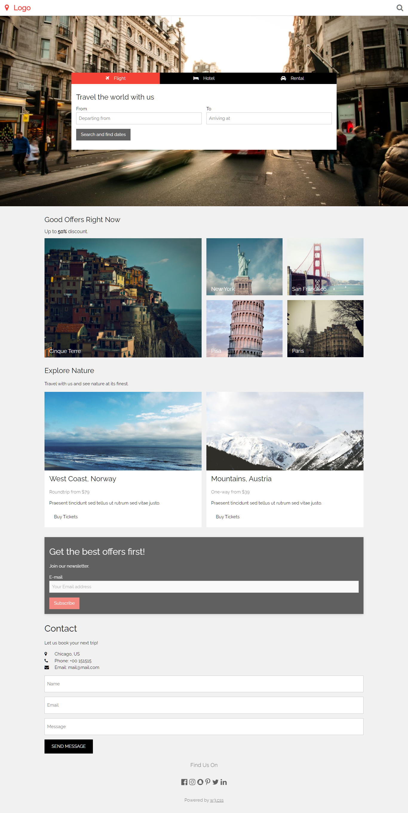
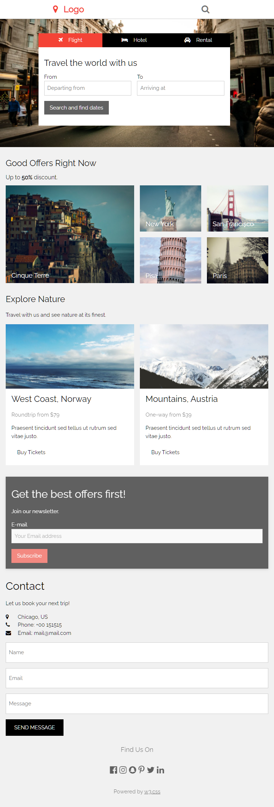
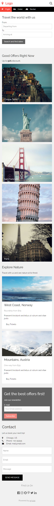
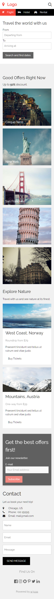

# Website de viagens ao mundo

## Sobre a autoria

Este projeto tem o intuito de aperfeiçoar, treinar e exercitar o conhecimento sobre as tecnologias da Web.
Todo código será criado sem framework, somente consultando o projeto gráfico e documentação do Mozilla MDN e DevMedia.

As imagens e design foram disponibilizadas pela equipe do [DevMedia](https://www.devmedia.com.br) neste [video](https://www.youtube.com/watch?v=YPYwND5WGxw&t=910s).

#

## Objetivo geral

Reproduzir o layout com a maior fidelidade possível.

## Ferramentas utilizadas

Estou utilizando o editor de código VSCODE-Insiders, sistema operacional GNU Arch Linux instalado e configurado manualmente, navegador Mozilla Firefox, controle de versão Git via CLI e extensão Live Server do VSCODE.

#

## Objetivos específicos

- Exercitar HTML e CSS
- Exercitar a codificação de um projeto gráfico de Website do zero
- Aplicar os conceitos e propriedades do CSS no documento HTML
- Estruturar o documento HTML
- Aplicar conhecimento de GIT e linha de comando
- Exercitar a busca por documentação técnica e boas práticas
- Aplicar design responsivo
- Utilizar media queries e calc

#

## Imagens layout/design do website
#

#### <b>1366px<b>

#

#### <b>768px<b>

#

#### <b>450px<b>

#

#### <b>320px<b>

#